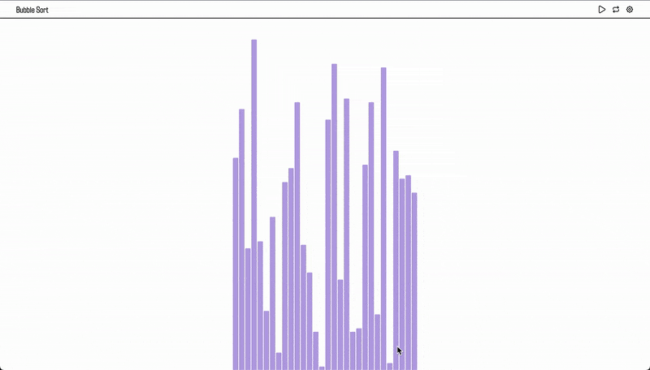

# Sortsight

A simple web application for visualizing various sorting algorithms. You can try it out [here](https://sortsight.surge.sh/)

## Algorithms

Currently the following algorithms are available

- Bubble sort (optimized version)
- Selection sort
- Insertion sort
- Merge sort
- Quick sort
- Heap sort
- Cocktail shaker sort

## Demo



## Running Instructions

To run locally make sure you have [node.js](https://nodejs.org/en) and [pnpm](https://pnpm.io/) installed and the run the following commands

```console
pnpm install
pnpm dev
```

## References

- Bubble Sort https://www.programiz.com/dsa/bubble-sort
- Selection Sort https://www.programiz.com/dsa/selection-sort
- Insertion Sort https://www.programiz.com/dsa/insertion-sort
- MergeSort
  - https://www.programiz.com/dsa/merge-sort
  - https://stackoverflow.com/questions/62993954/how-do-i-make-this-merge-sort-function-a-generator-python
- QuickSort https://www.programiz.com/dsa/quick-sort
- Cocktail shaker sort https://en.wikipedia.org/wiki/Cocktail_shaker_sort
